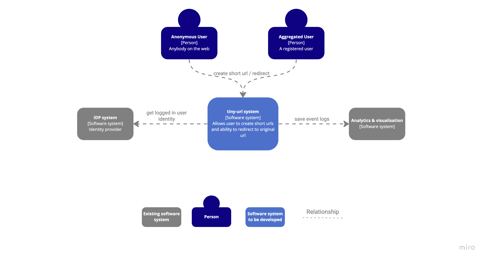
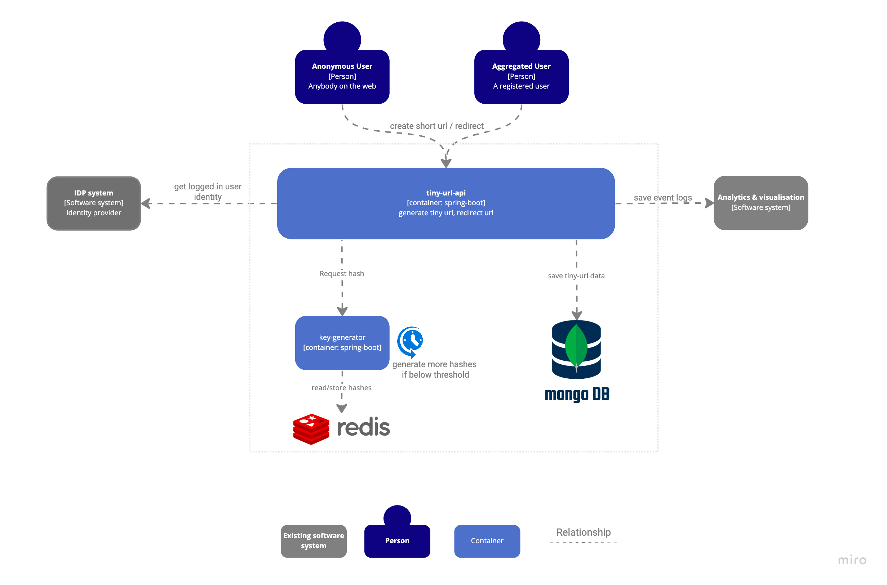

# tiny-url-system

### C1 Context Diagram



### C2 Container Diagram


### TechStack
Java:18, Spring boot, Mongodb, Redis, Docker

### To Run locally
1. in project root dir `bash scripts/dev.sh up --rebuild`
2. in module tiny-url-api dir `./gradlew bootRunDev`

### Generate short url
```
curl --location --request POST 'http://localhost:8095/api/v1/tiny-url' \
--header 'Content-Type: application/json' \
--data-raw '{
    "url": "https://google.com"
}'
```
